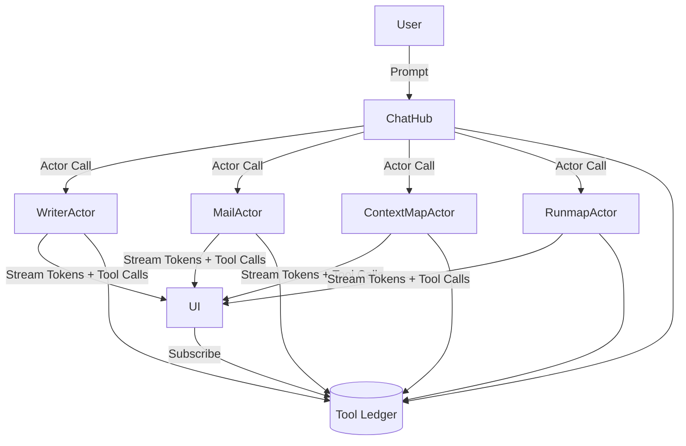

# Chat-Actor-Ledger Architecture
Updated: 2026-01-30
Status: DRAFT

## Summary
ChoirOS is redesigned around a **Chat Hub** that orchestrates a set of **program actors**. Each program (Writer, Mail, Context Map, Runmap, etc.) is an actor with its own state and streaming output. All prompts, actor calls, tool calls, and results are recorded in a **durable Tool Ledger** for replayability. There is no message bus and no projector. The ledger is the source of truth.

This is a clean break from the NATS event system. The new architecture emphasizes:
- **Chat as the control plane** (default app)
- **Programs as actors** (each app is an actor)
- **Tool calls as actor messages** (Agent-as-Tool)
- **Replayability via a DB ledger** (not a broker)

---

## Goals
- Make the **Chat app the central orchestrator**.
- Treat each program as an **actor with a private state machine**.
- Replace event streaming with a **durable ledger** for replay.
- Support **streaming tokens + tool calls** from any actor to the UI.
- Enable **direct actor-to-actor calls** as the primary tool mechanism.

## Non-Goals
- Supporting legacy NATS pipelines or projector-based projections.
- Maintaining existing auditor workers or special-purpose agents.
- Guaranteeing strict global determinism across all replays (best-effort with snapshots).

---

## Core Concepts

### 1) Chat Hub (Control Plane)
- The default app and the only universal entry point.
- Orchestrates tasks and routes work to program actors.
- Owns the primary prompt bar and session state.

### 2) Program Actors
Each program is an actor with its own state and interface:
- **WriterActor**: document state, edits, diffs
- **MailActor**: thread state, drafts
- **ContextMapActor**: context graph / heatmap
- **RunmapActor**: execution graph
- **TerminalActor**: command history

Actors accept prompts and stream back tokens and tool calls. Actors can call other actors as tools.

### 3) Tool Ledger (Durable Log)
A durable, append-only log that records:
- Chat prompts
- Actor calls + results
- Tool calls + results
- Snapshots

The Tool Ledger replaces NATS as the source of replayability.

### 4) Agent-as-Tool
A “tool” is a message to an actor:
- Tools are actor method calls
- Tool results are actor outputs
- Tool calls are logged to the ledger

---

## Architecture Diagram

---

## Runtime Components

### Actor Runtime
- Prefer **Ray** for a simple Python actor model, or a custom asyncio actor loop.
- Responsible for:
  - Actor lifecycle
  - Message routing
  - Streaming output channel

### Tool Ledger Service
- DB-backed append-only ledger.
- Provides:
  - Append event
  - Query by session/run/actor
  - Stream updates (SSE/WebSocket)

### Chat Hub
- Orchestrates user tasks and actor calls.
- Maintains session context and shared state.

---

## Ledger Schema (Minimal)

### Runs
- `runs(id, session_id, status, created_at, updated_at)`

### Ledger Events
- `ledger_events(id, run_id, session_id, actor_id, type, payload_json, created_at, seq)`

Event types:
- `chat.prompt`
- `actor.call`
- `actor.stream.token`
- `tool.call`
- `tool.result`
- `actor.state.snapshot`
- `run.complete`

---

## Execution Flow

### A) Prompt → Chat Hub
1. User submits prompt in Chat app
2. ChatHub logs `chat.prompt`
3. ChatHub chooses an actor

### B) Actor Execution
1. ChatHub calls actor
2. Actor streams tokens + tool calls
3. Actor writes to ledger

### C) UI Updates
1. UI subscribes to ledger stream
2. UI renders changes in relevant apps

---

## Streaming Model
- Actors emit streaming chunks:
  - tokens
  - tool calls
  - tool results
- The UI is built to render partial results live.
- The ledger records the same events for replay.

---

## Replayability
- Replay is driven by the ledger, not a broker.
- Two modes:
  1. **Full replay**: re-run from `chat.prompt` and tool calls
  2. **Snapshot replay**: restore `actor.state.snapshot` and replay deltas

Limitations:
- External tools may need stubs for deterministic replay.
- Snapshots reduce drift and cost.

---

## State Ownership
- Each actor owns its internal state.
- The ledger is the cross-actor observable record.
- The UI reads the ledger but does not mutate state directly.

---

## API Surface (Abstract)

### Ledger
- `POST /ledger/event` (append)
- `GET /ledger?session_id=...` (query)
- `GET /ledger/stream?session_id=...` (SSE/WebSocket)

### Actors
- `POST /actors/{actor_id}/call`
- `GET /actors/{actor_id}/state`
- `POST /actors/{actor_id}/snapshot`

### Chat Hub
- `POST /chat/prompt`
- `GET /chat/session/{id}`

---

## Observability
- Ledger is the single source of truth for observability.
- Metrics can be derived by:
  - counting ledger event types
  - measuring time between `actor.call` and `tool.result`
  - tracking token throughput via `actor.stream.token`

---

## Security & Tenancy
- Session-scoped ledger entries (session_id + user_id).
- Actor calls validated by ChatHub or auth service.
- UI scoped to the current session.

---

## Deployment
- **Single process** for dev (chat + actors + ledger).
- **Multi-process** for prod:
  - Actor runtime service
  - Ledger service
  - UI frontend

---

## Deletions (Clean Break)
- Remove NATS and JetStream
- Remove projector workers
- Remove auditor workers
- Remove special-purpose auditor agent

---

## Open Questions
- Which actor runtime (Ray vs asyncio vs Rust/Elixir)?
- How to scope actor state across sessions (per-session actors vs shared)?
- How to enforce deterministic replay for external tools?
- Do we need ledger compaction or snapshot TTLs?

---

## Acceptance Criteria
- Chat hub can route tasks to program actors.
- Actors stream tokens and tool calls live.
- Ledger captures all prompts, calls, results, and snapshots.
- Replay is possible using ledger + snapshots.

