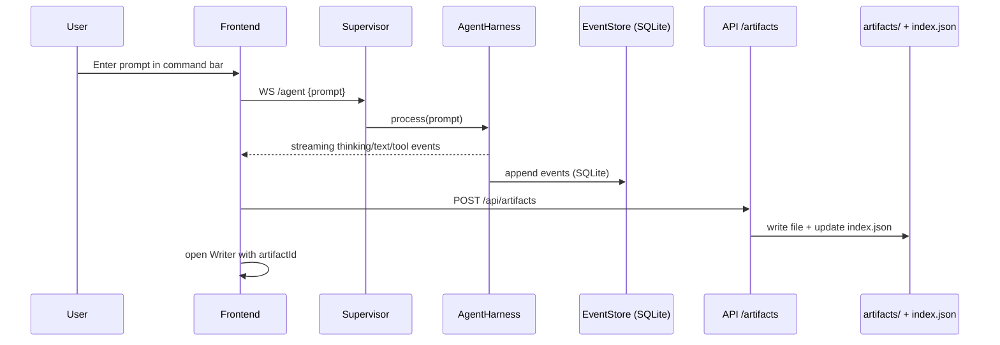
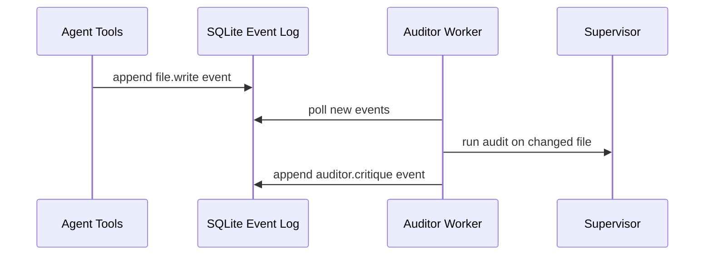
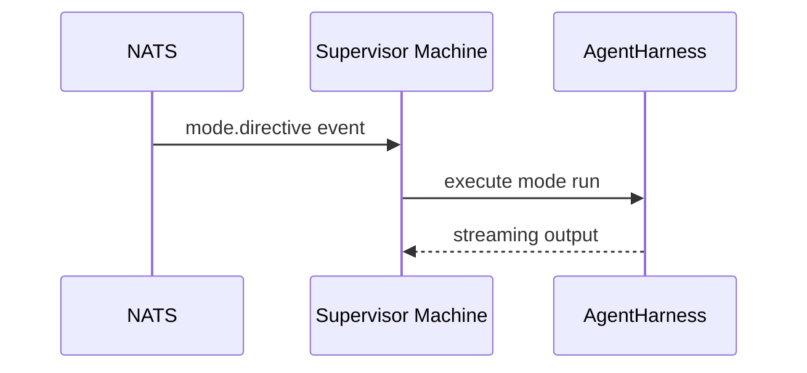

# Current Architecture (Jan 23, 2026)

This document captures the current, working architecture of ChoirOS as of 2026-01-23, including the runtime data flows, persistence strategy, and immediate/intermediate next steps.

## Executive Summary
- **Frontend (React/Vite)** provides the desktop UI and the command bar, streaming agent responses over a WebSocket.
- **Supervisor (FastAPI)** orchestrates runs, executes tools, and records events to a local SQLite event log (`state.sqlite`).
- **NATS JetStream** is optional today; events are published when available, but SQLite remains the local event log and projection source.
- **API (FastAPI)** provides parsing utilities and a **file-backed artifact store** (saved under `artifacts/` with an `index.json` catalog).
- **Auditor worker** polls SQLite for file changes and appends `auditor.critique` events.

## System Topology

```mermaid
graph LR
    User[User / Browser]
    Frontend[Frontend (choiros, React/Vite)]
    Supervisor[Supervisor (FastAPI)]
    API[API (FastAPI)]
    SQLite[state.sqlite
(event log + projections)]
    Artifacts[artifacts/
index.json + files]
    NATS[NATS JetStream
(optional)]
    Auditor[Auditor Worker]
    Sandbox[Sandbox Runner
(local or Sprites)]

    User -->|HTTP/WS| Frontend
    Frontend -->|WS /agent| Supervisor
    Frontend -->|HTTP /api| API
    Supervisor -->|Events| SQLite
    Supervisor -->|Publish| NATS
    Supervisor -->|Exec| Sandbox
    API -->|Create/read artifacts| Artifacts
    Auditor -->|Polls| SQLite
```

## Core Data Flows

### 1) Command Bar → Agent → Writer



**Notes:**
- The frontend saves the full prompt/response to an artifact and opens Writer on completion.
- Writer loads the artifact content by ID from the API.

### 2) File Change → Auditor



**Notes:**
- The auditor is a background loop polling SQLite. It is not NATS-driven today.

### 3) Mode Directives via NATS (Optional)



**Notes:**
- When NATS is enabled, the supervisor listens for directives and executes them through the Machine + RunOrchestrator.

## Storage Model (Current)

### Event Log
- **Primary local store:** `state.sqlite`
- **Event structure:** event type + JSON payload, with optional `nats_seq`.
- **NATS status:** best-effort publish when enabled; SQLite remains canonical in local dev.

### Artifacts
- **Physical storage:** `artifacts/` directory
- **Index:** `artifacts/index.json`
- **API usage:** `POST /api/artifacts` writes file + index; `GET /api/artifacts/{id}` returns content.

### Workspace Files
- The repo itself is the working filesystem. Tool writes generate `file.write` events and are audited by the worker loop.

## Runtime Components

### Frontend (`/choiros`)
- Web desktop UI with command bar.
- Opens Writer windows for artifact content.

### Supervisor (`/supervisor`)
- Orchestrates runs and executes tools.
- Emits events into SQLite and optionally NATS.
- Hosts `/agent` WebSocket for streaming agent responses.

### API (`/api`)
- Parsing endpoints for URLs/uploads.
- Artifact CRUD endpoints backed by the filesystem.

### Auditor Worker (`/supervisor/auditor_worker.py`)
- Polls SQLite for file changes and records critiques.

### NATS JetStream (optional)
- Event bus + directive channel.
- Used for publish/subscribe when enabled.

## Known Bottlenecks and Risks
- **Event throughput:** UI event stream can be noisy; no batching or backpressure.
- **Dual persistence:** SQLite is authoritative in local dev; NATS only partially used, which complicates recovery semantics.
- **Artifact index drift:** legacy in-memory artifacts can leave name/path inconsistencies in `index.json`.

## Immediate Next Steps (1–2 weeks)
1. **Decide source-of-truth** (NATS-only vs SQLite-first) and implement a projector if moving to NATS-only.
2. **Artifact migration**: normalize legacy artifact names/paths and add a simple backfill command.
3. **Stream hygiene**: add batching/backpressure for event stream and reduce redundant toasts.

## Intermediate Next Steps (1–2 months)
1. **JetStream projector → libsql**: move projections to libsql (or Turso) with replay capability.
2. **Work-queue execution**: decouple command bar from run execution; queue work and visualize state.
3. **Visualization graph**: map receipts, artifacts, AHDB deltas, and verifier outcomes.
4. **AgentFS integration**: standardize filesystem diffs as canonical state changes.

## Related Docs
- `docs/ARCHITECTURE_OVERVIEW.md`
- `docs/specs/CHOIR_EVENT_CONTRACT_SPEC.md`
- `docs/specs/CHOIR_MACHINE_V0_SPEC.md`
- `docs/specs/CHOIR_AGENTFS_INTEGRATION_SPEC.md`
